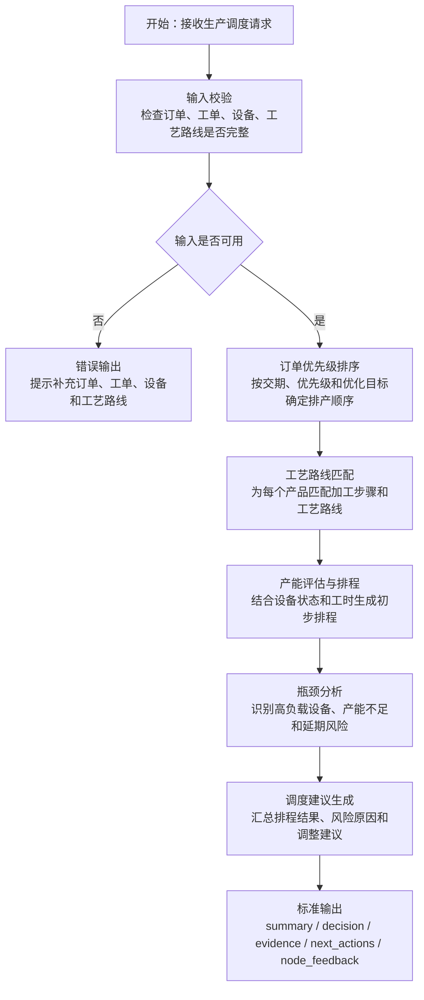
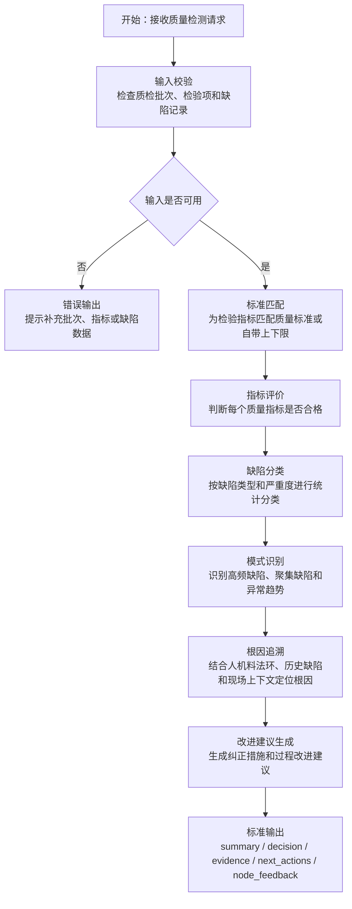
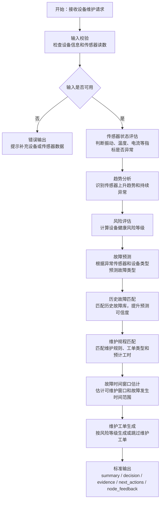
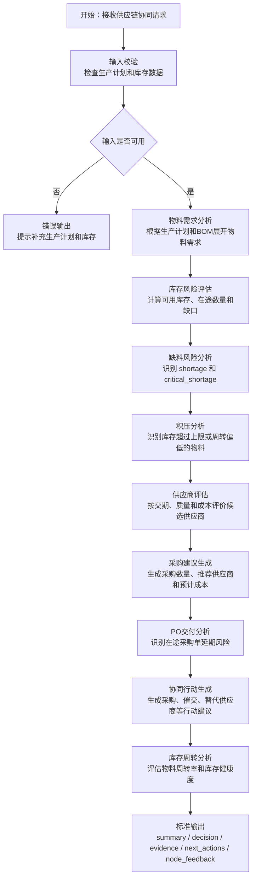
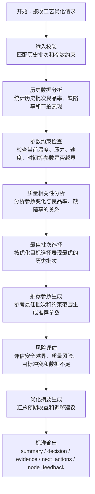

# 五个智能体流程图

本文档用于项目讲解与录屏说明，覆盖 5 个独立智能体的业务流程。每个流程图均标注节点作用，和后端接口返回的 `node_feedback` 节点式反馈保持一致。

## 1. 生产调度优化智能体

职责：根据订单、工单、工艺路线、设备产能与交期约束，完成订单优先级排序、产能评估、瓶颈分析和调度建议生成。

节点说明：

| 节点 | 作用 |
|---|---|
| 输入校验 | 判断订单、工单、设备、工艺路线是否齐全，避免无效排程。 |
| 订单优先级排序 | 根据交期、订单优先级和优化目标确定处理顺序。 |
| 工艺路线匹配 | 将产品和工艺路线绑定，发现路线缺失问题。 |
| 产能评估与排程 | 根据设备可用性、工时和工序生成排程计划。 |
| 瓶颈分析 | 识别设备负载过高、产能不足、延期等风险。 |
| 调度建议生成 | 输出调度决策、证据和下一步操作建议。 |

## 2. 质量检测与缺陷分析智能体

职责：分析质检数据、缺陷记录、质量标准和现场上下文，识别质量风险、缺陷模式，并按人机料法环追溯根因。

节点说明：

| 节点 | 作用 |
|---|---|
| 输入校验 | 确认质检批次、检验指标或缺陷记录满足分析条件。 |
| 标准匹配 | 将检测指标与质量标准绑定，识别标准缺失。 |
| 指标评价 | 判断指标是否超出标准范围，形成合格/不合格结论。 |
| 缺陷分类 | 按缺陷类型、严重度、数量统计质量问题。 |
| 模式识别 | 发现高频缺陷或批量性缺陷模式。 |
| 根因追溯 | 结合人、机、料、法、环和历史缺陷定位原因。 |
| 改进建议生成 | 给出隔离、复检、纠正措施和持续改进建议。 |

## 3. 设备预测性维护智能体

职责：分析设备传感器数据、历史故障和维护规程，预测故障类型与风险等级，并在需要时生成维护工单。

节点说明：

| 节点 | 作用 |
|---|---|
| 输入校验 | 确认设备基础信息和传感器数据存在。 |
| 传感器状态评估 | 判断振动、温度、电流等读数是否 normal、warning 或 critical。 |
| 趋势分析 | 分析同类传感器的变化趋势，发现持续上升或异常波动。 |
| 风险评估 | 汇总传感器异常和设备状态，形成健康风险等级。 |
| 故障预测 | 预测可能故障类型、根因和置信度。 |
| 历史故障匹配 | 匹配历史故障案例，补充故障证据。 |
| 维护规程匹配 | 选择合适维护规则、工单类型和预计工时。 |
| 故障时间窗口估计 | 估算故障可能发生时间和建议维护窗口。 |
| 维护工单生成 | 对高风险设备提前生成维护工单，避免非计划停机。 |

## 4. 供应链协同管理智能体

职责：根据生产计划、BOM、库存、采购单和供应商数据，识别缺料、积压、延期和供应商风险，生成采购与协同行动建议。

节点说明：

| 节点 | 作用 |
|---|---|
| 输入校验 | 确认生产计划和库存数据可用于供应链分析。 |
| 物料需求分析 | 根据生产计划和 BOM 计算物料需求。 |
| 库存风险评估 | 结合库存和在途采购单判断可用数量。 |
| 缺料风险分析 | 判断普通缺料和严重缺料。 |
| 积压分析 | 找出库存过高、周转偏低或超出上限的物料。 |
| 供应商评估 | 根据交付、质量、成本等维度评估供应商风险。 |
| 采购建议生成 | 给出采购数量、供应商和成本建议。 |
| PO交付分析 | 识别在途采购单延期风险及其影响。 |
| 协同行动生成 | 形成采购、催交、供应商替换等跨部门行动。 |
| 库存周转分析 | 评估物料周转效率，降低缺料和积压风险。 |

## 5. 工艺参数优化智能体

职责：分析历史批次、当前参数、参数约束和质量反馈，识别参数与质量关系，推荐更优工艺参数组合。

节点说明：

| 节点 | 作用 |
|---|---|
| 输入校验 | 匹配工艺、产品、历史批次和参数约束，判断数据是否足够。 |
| 历史数据分析 | 汇总历史批次的良品率、缺陷率和效率表现。 |
| 参数约束检查 | 检查当前工艺参数是否超出允许范围，尤其是安全关键参数。 |
| 质量相关性分析 | 判断参数变化与质量结果之间是否存在明显趋势。 |
| 最佳批次选择 | 按良品率、缺陷率或节拍目标选出参考批次。 |
| 推荐参数生成 | 根据最佳批次和约束范围推荐参数组合。 |
| 风险评估 | 识别参数越界、安全风险、目标冲突和历史数据不足。 |
| 优化摘要生成 | 输出预期改善、推荐理由和后续验证建议。 |

## 统一输出说明

5 个智能体最终都会返回统一结构，便于前端展示、历史追溯和业务闭环聚合：

| 字段 | 说明 |
|---|---|
| `summary` | 本次分析的业务摘要。 |
| `decision` | 智能体给出的核心决策或风险状态。 |
| `evidence` | 支撑决策的证据，包括计算结果和知识库命中内容。 |
| `next_actions` | 建议下一步执行的业务动作。 |
| `node_feedback` | 节点式执行反馈，用于展示每一步是否完成、异常或告警。 |

