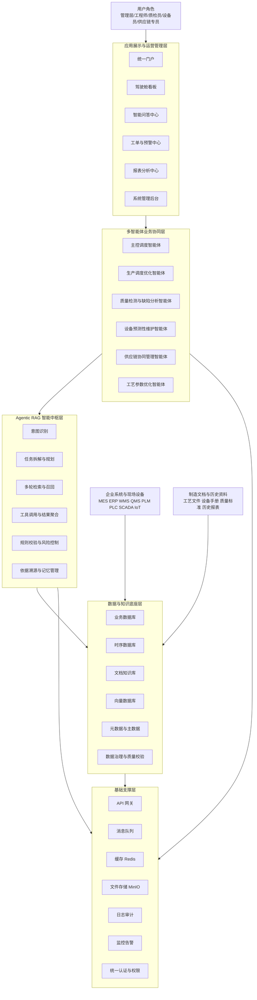
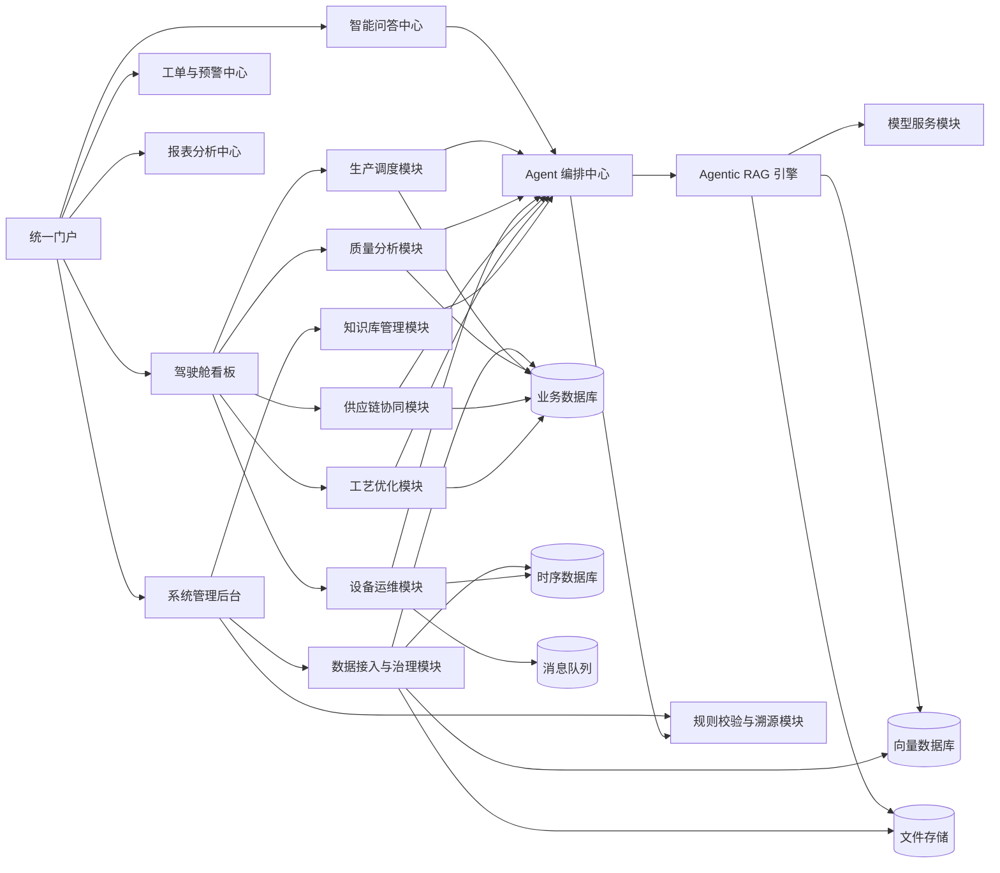
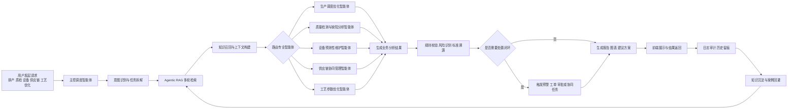
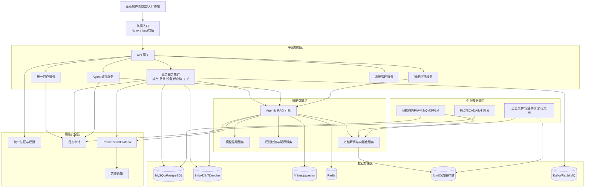

# 《基于Agentic RAG与多智能体协作的智能制造服务平台》项目框架

## 一、项目定位

### 1.1 项目名称

基于 Agentic RAG 与多智能体协作的智能制造服务平台

### 1.2 项目定义

本项目面向制造企业生产管理、质量控制、设备运维、供应链协同与工艺优化等核心场景，建设一套集知识管理、智能推理、业务协同、可视化运营于一体的企业级智能制造服务平台。

平台以 Agentic RAG 为智能中枢，以多智能体协作为执行机制，以制造知识库和业务数据中台为底座，实现从"被动问答"向"智能分析、辅助决策、闭环执行"升级。

### 1.3 建设目标

- 建设统一的制造知识服务底座，沉淀工艺、设备、质量、供应链等核心知识资产
- 构建可扩展的 Agentic RAG 引擎，实现复杂问题拆解、多轮检索、结果校验与依据溯源
- 打造多智能体协作体系，支撑生产调度、质量分析、设备维护、供应链协同、工艺优化五大业务域
- 建设企业级 Web 管理门户与业务看板，形成可视化、可追踪、可运营的平台能力
- 形成标准化、模块化、可持续演进的智能制造服务平台架构

---

## 二、建设背景与业务痛点

### 2.1 行业背景

当前制造企业正处于数字化、网络化、智能化转型的关键阶段，但多数企业仍面临系统分散、知识孤岛、智能能力不足、决策依赖经验等问题。

### 2.2 核心痛点

- 智能化建设成本高，中小制造企业难以快速落地
- 工艺、设备、质量知识分散，缺乏统一沉淀与复用机制
- 质量检测、故障分析、工艺优化高度依赖资深工程师经验
- 设备维护以事后维修或定期维护为主，缺乏预测性能力
- 采购、库存、排产、物流数据割裂，跨部门协同效率低
- 传统 RAG 只能回答单点问题，无法处理复杂制造场景中的任务拆解与协同执行

### 2.3 项目价值主张

通过"制造知识库 + Agentic RAG + 多智能体协作 + 业务可视化平台"的整体方案，帮助企业实现知识可沉淀、问题可分析、决策可辅助、过程可追踪、结果可评估。

---

## 三、总体建设思路

### 3.1 建设原则

- 业务驱动：围绕制造核心业务场景建设，而非单纯技术堆叠
- 分层解耦：实现数据层、智能层、业务层、应用层职责清晰
- 标准统一：统一数据标准、知识标准、接口标准、权限标准
- 平台化设计：支持后续新增智能体、业务模块和行业场景扩展
- 安全可控：满足企业级权限、审计、日志、安全与私有化部署要求

### 3.2 总体蓝图

平台整体采用五层架构：

1. 数据接入层
2. 数据与知识底座层
3. Agentic RAG 智能中枢层
4. 多智能体业务协同层
5. 应用展示与运营管理层

---

## 四、企业级总体架构

### 4.1 架构分层

#### 4.1.1 数据接入层

负责对接企业内外部业务系统、设备系统和文档资料，形成统一接入能力。

**接入对象：**

- MES、ERP、WMS、SCM、QMS、PLM 等业务系统
- PLC、SCADA、传感器、IoT 网关、设备日志系统
- 工艺规范、设备手册、作业指导书、质检标准、历史报表
- Excel、PDF、Word、图片、CSV、数据库表、接口数据

#### 4.1.2 数据与知识底座层

负责结构化数据存储、非结构化文档处理、知识抽取、向量索引、时序数据存储与统一治理。

**核心组成：**

- 业务数据库
- 时序数据库
- 文档知识库
- 向量数据库
- 元数据管理
- 主数据管理
- 数据治理与质量校验模块

#### 4.1.3 Agentic RAG 智能中枢层

作为全平台核心智能引擎，承担任务理解、规划编排、知识检索、推理生成、结果校验和依据溯源等职责。

**核心能力：**

- 用户意图识别
- 问题拆解与任务规划
- 多轮动态检索
- 工具调用与结果聚合
- 风险识别与合规校验
- 标准条款溯源
- 记忆管理与上下文管理

#### 4.1.4 多智能体业务协同层

面向具体业务域，构建职责明确、可独立演进、可协同调度的专业智能体体系。

**协同机制：**

- 主控调度智能体统一分发任务
- 专业智能体按领域执行分析与决策
- 跨智能体共享知识、上下文和任务状态
- 支持串行协作、并行协作、回退纠错和人工审核

#### 4.1.5 应用展示与运营管理层

提供统一门户、业务看板、预警中心、智能问答入口、工单中心、报表中心和系统管理后台。

### 4.2 系统架构图

### 4.3 系统架构说明

- 顶层为业务入口，承载用户访问、可视化展示、问答交互、工单处理和系统运营
- 中间层为多智能体协同体系，负责按照业务域拆分任务并执行专业分析
- 智能中枢层负责理解问题、规划任务、调用知识、生成结果并完成校验
- 数据与知识底座层负责沉淀结构化、非结构化、时序化和向量化数据资产
- 基础支撑层为平台提供网关、认证、缓存、消息、日志、监控等企业级支撑能力

---

## 五、业务架构设计

### 5.1 业务域划分

平台聚焦五大核心业务域：

- 生产调度与排产优化
- 质量检测与缺陷根因分析
- 设备健康监测与预测性维护
- 供应链协同与库存优化
- 工艺参数优化与知识复用

### 5.2 智能体体系设计

#### 5.2.1 主控调度智能体

负责统一接收用户任务，识别业务场景，拆分任务链路，协调其他专业智能体执行，并汇总最终结果。

#### 5.2.2 生产调度优化智能体

负责生产计划编排、工单排程优化、产能匹配、资源冲突识别、瓶颈分析及交期平衡。

#### 5.2.3 质量检测与缺陷分析智能体

负责质量标准检索、缺陷模式识别、质量异常归因、缺陷闭环分析与整改建议输出。

#### 5.2.4 设备预测性维护智能体

负责设备状态监测、故障特征识别、故障预测、保养建议、维护工单触发与停机风险预警。

#### 5.2.5 供应链协同管理智能体

负责采购建议、库存预警、物料齐套分析、供应商协同与交付风险分析。

#### 5.2.6 工艺参数优化智能体

负责工艺参数分析、质量关联挖掘、参数推荐、工艺知识复盘与持续优化建议生成。

---

## 六、应用架构设计

### 6.1 门户端功能模块

- 首页驾驶舱
- 智能问答与任务协同中心
- 生产调度中心
- 质量管理中心
- 设备运维中心
- 供应链协同中心
- 工艺优化中心
- 知识库管理中心
- 报表与分析中心
- 系统管理与权限中心

### 6.2 管理后台功能模块

- 用户与角色管理
- 租户与组织管理
- 数据源接入管理
- 知识库构建管理
- 模型与智能体配置管理
- 工作流与规则编排管理
- 日志审计与告警管理
- 参数配置与运维管理

### 6.3 模块关系图

### 6.4 模块关系说明

- 统一门户负责聚合各业务中心，形成单入口访问体验
- 各业务模块通过 Agent 编排中心接入智能能力，避免重复建设
- Agentic RAG 引擎作为智能底座，统一连接模型服务、向量检索和知识文件
- 数据接入与治理模块负责将企业系统、设备数据和文档资料加工为平台可用资产
- 工单、报表、后台管理与业务模块形成闭环，支撑平台运营和持续优化

---

## 七、技术架构设计

### 7.1 技术架构原则

- 前后端分离
- 微服务或模块化服务架构
- 统一 API 网关接入
- 支持私有化部署与弹性扩展
- 支持高并发访问与异步任务处理

### 7.2 推荐技术选型

| 架构层 | 推荐技术 |
| --- | --- |
| 前端层 | Vue 3、TypeScript、Element Plus、ECharts |
| 网关层 | Nginx、Spring Cloud Gateway 或 APISIX |
| 后端服务层 | FastAPI 或 Spring Boot |
| 智能编排层 | LangGraph、LangChain、AutoGen 或自研 Agent Orchestrator |
| 模型服务层 | Qwen、Llama、DeepSeek、企业私有大模型服务 |
| 向量检索层 | Milvus、Chroma、pgvector |
| 业务数据层 | MySQL、PostgreSQL |
| 时序数据层 | InfluxDB、TDengine |
| 缓存层 | Redis |
| 消息队列 | RabbitMQ、Kafka |
| 文件存储 | MinIO、NAS、对象存储 |
| 监控运维 | Prometheus、Grafana、ELK |

### 7.3 服务划分建议

- 用户与权限服务
- 知识库管理服务
- 文档解析与向量化服务
- Agent 编排服务
- 智能问答服务
- 生产调度服务
- 质量分析服务
- 设备运维服务
- 供应链分析服务
- 工艺优化服务
- 日志审计与告警服务

---

## 八、数据架构设计

### 8.1 数据分类

- 主数据：设备、产线、物料、工单、供应商、工艺路线
- 业务数据：生产计划、库存记录、采购记录、质检记录、维修记录
- 时序数据：温度、振动、电流、转速、压力等设备实时数据
- 文档数据：工艺规程、作业指导书、质量标准、设备手册
- 知识数据：抽取后的实体、关系、标签、规则、经验案例

### 8.2 数据治理要求

- 统一编码体系和命名规范
- 统一数据接入标准和接口规范
- 建立数据质量校验机制
- 建立文档版本管理与知识更新机制
- 建立数据权限、脱敏、审计和留痕机制

### 8.3 知识库建设范围

- 工艺知识库
- 设备运维知识库
- 质量标准知识库
- 供应链协同知识库
- 历史案例知识库
- 故障代码与应对策略知识库

---

## 九、核心智能流程设计

### 9.1 标准处理流程

1. 用户发起业务请求或系统触发分析任务
2. 主控调度智能体识别场景并进行任务拆解
3. Agentic RAG 引擎执行多轮检索、知识召回与上下文构建
4. 专业智能体完成领域分析、推理与建议生成
5. 系统进行规则校验、标准溯源、风险提示与结果打分
6. 输出报告、图表、建议方案或自动触发业务工单
7. 全流程记录审计日志，沉淀至知识库与历史案例库

### 9.2 业务流程图

### 9.3 流程说明

- 用户请求先进入主控调度智能体，由其判断场景并拆解任务
- Agentic RAG 引擎负责多轮检索、知识召回和上下文组织，保障分析依据充分
- 不同专业智能体按业务域执行分析，最终汇总为统一结果
- 结果输出前需经过规则校验、风险识别和标准溯源，提升结果可信度
- 业务结果既可直接展示，也可进一步触发预警、工单和审批流程，形成闭环
- 全流程日志、案例和处理结果会持续回灌知识库，支撑平台自我优化

### 9.4 闭环能力设计

- 问题受理闭环
- 分析决策闭环
- 预警处置闭环
- 工单执行闭环
- 知识沉淀闭环

---

## 十、非功能架构设计

### 10.1 安全设计

- 统一身份认证与单点登录
- 基于角色的权限控制与细粒度数据授权
- 操作日志、审计日志、模型调用日志全量留痕
- 敏感数据脱敏、传输加密、存储加密
- 支持本地化和私有化部署，保障企业数据安全

### 10.2 性能设计

- 支持高并发查询与异步分析任务
- 热点数据缓存与分层存储
- 向量检索性能优化与分片扩容
- 消息队列削峰填谷与任务解耦

### 10.3 可运维设计

- 服务健康检查
- 调用链监控
- 模型推理监控
- 告警通知机制
- 日志集中采集与问题追踪

### 10.4 可扩展设计

- 支持新增业务智能体
- 支持新增知识库类型
- 支持新增模型服务和工具插件
- 支持多工厂、多车间、多租户扩展

---

## 十一、部署架构设计

### 11.1 部署模式

- 单机试点部署
- 企业内网私有化部署
- 容器化部署
- 云边协同部署

### 11.2 部署架构图

### 11.3 部署架构说明

- 用户统一通过浏览器、大屏或企业终端访问平台入口，再由网关转发至各类服务
- 平台应用区承载门户、业务服务、Agent 编排、问答服务和后台管理能力
- 智能引擎区承载 Agentic RAG、模型推理、规则校验和文档向量化处理能力
- 数据存储区分别承担业务数据、时序数据、向量数据、缓存、文件和消息通信能力
- 企业数据源区通过接口、网关或离线导入方式接入平台，形成统一数据底座
- 运维安全区提供认证、日志、监控和告警能力，满足企业级部署要求

### 11.4 部署组件

- Web 前端服务
- API 网关
- 业务服务集群
- Agent 编排服务
- 模型推理服务
- 向量数据库
- 关系数据库
- 时序数据库
- 消息队列
- 文件存储
- 监控与日志平台

### 11.5 环境划分

- 开发环境
- 测试环境
- 预生产环境
- 生产环境

---

## 十二、项目实施路线

### 12.1 一期建设

目标：完成平台基础底座与核心智能能力建设。

**范围建议：**

- 完成统一门户与基础权限体系
- 完成知识库接入与向量检索能力
- 完成 Agentic RAG 核心引擎
- 上线生产调度、质量分析、设备维护 3 个核心智能体
- 建设基础驾驶舱与智能问答中心

### 12.2 二期建设

目标：完善业务闭环和多智能体协同能力。

**范围建议：**

- 上线供应链协同与工艺优化智能体
- 打通工单、预警、报表、审批等业务流程
- 增加多源数据融合与模型效果评估机制
- 建立知识持续学习与案例回灌机制

### 12.3 三期建设

目标：实现规模化推广与平台化运营。

**范围建议：**

- 支持多工厂、多组织、多租户
- 支持更多设备协议和行业场景模板
- 建立运营分析、成本分析和价值评估体系
- 形成标准化产品方案并推广复制

---

## 十三、预期成果与交付物

### 13.1 平台成果

- 一套企业级智能制造服务平台
- 一套 Agentic RAG 智能中枢能力
- 一套多智能体协同机制
- 一套制造知识库与知识治理体系
- 一套可视化运营与分析门户

### 13.2 文档交付物

- 项目立项书
- 需求规格说明书
- 总体架构设计说明书
- 详细设计说明书
- 数据架构与接口说明书
- 测试方案与测试报告
- 部署手册与运维手册
- 用户操作手册

---

## 十四、项目创新点

### 14.1 智能能力创新

将传统检索问答升级为具备任务规划、动态检索、自我校验和依据溯源能力的 Agentic RAG 体系。

### 14.2 架构模式创新

采用"智能中枢 + 多智能体协同 + 业务闭环"模式，增强复杂制造场景的任务处理能力。

### 14.3 业务价值创新

实现生产、质量、设备、供应链、工艺五大场景的一体化智能服务，提升平台落地价值。

### 14.4 工程落地创新

兼顾试点验证、企业部署、平台扩展和持续运营，具备较强的工程化与产品化能力。

---

## 十五、总结

本项目不是单一问答系统，而是一个面向制造企业核心业务流程的企业级智能服务平台。其核心价值在于，以知识为底座、以智能为引擎、以多智能体为协同机制、以业务闭环为落地方向，最终形成可部署、可运营、可扩展、可复制的智能制造解决方案。
